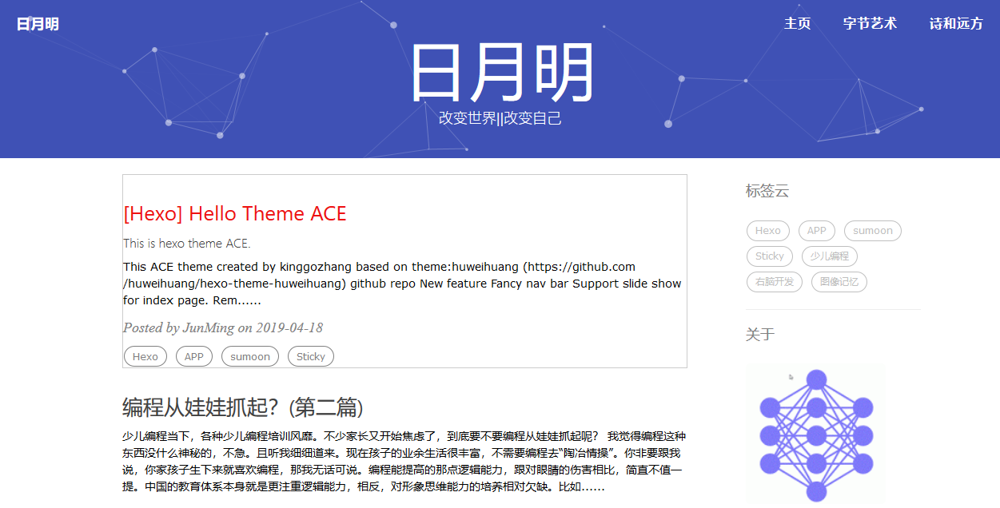
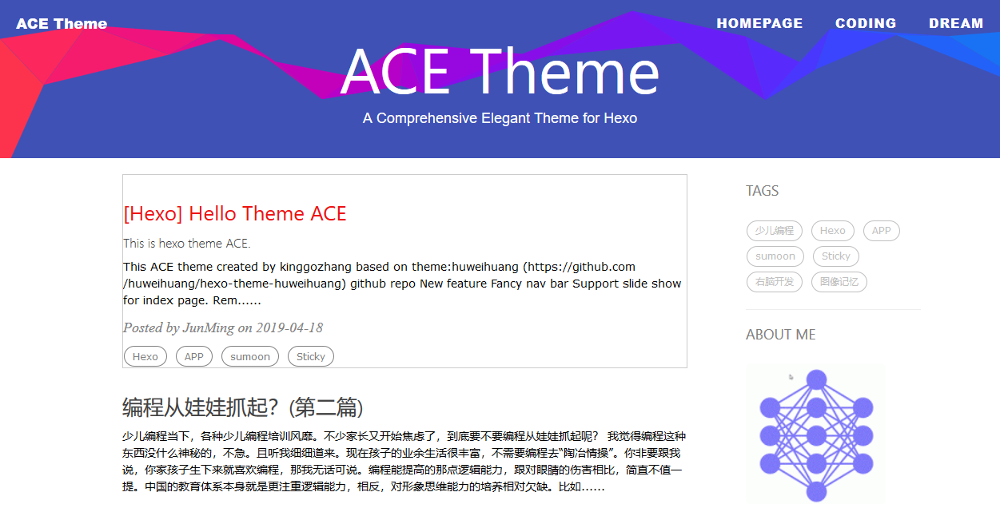

> 开源HEXO主题，我命名为 [ACE](https://github.com/kinggozhang/hexo-theme-ace) 这是我第一个HEXO主题，他借鉴了很多其他开源主题的代码。
> 具体请查看下面 感谢与引用. 
# [English Version](https://github.com/kinggozhang/hexo-theme-ace/blob/master/README-en.md)
# 特性列表
 1. 好看的导航条
 2. 支持首页滚动图片显示. 
 3. 自定义菜单
 4. 添加彩带、几何特效.
 5. 支持文章置顶.
 6. 多语言
 7. 支持 Valine 评论系统.
# 在线 Demo

在线 Demo : [www.sumoon.com](http://www.sumoon.com/)

截图:


# 版权信息
自由使用，欢迎加个友链 ^_^

# 安装 Hexo

```shell
npm install hexo-cli -g
```
Access <https://hexo.io> for more info
# 主题使用

## 下载ACE 主题

```bash
cd your_blog_dir
git clone https://github.com/kinggozhang/hexo-theme-ace.git themes/ace
```

## 修改你的主题
Change theme with 'ace'
```yml
## Themes: https://hexo.io/themes/
theme: ace
```
## 修改主题配置

修改 `themes/ace/_config.yml`
## 各个属性介绍:
### 导航菜单
修改主题配置，支持二级菜单。

```
navmenu: [
{
   title: "menu1",
   url: "#menu1",
   children: [
   {
       title: "menu1-1",
       url: "#menu1-1"
   },
   {
       title: "menu1-2",
       url: "#menu1-2"
   }
   ]   
},
{
   title: "menu2",
   url: "#menu2",        
}
]

```
> 修改layout/_partial/nav.ejs 可自定义。

### 头部修饰
```yml
slideshow: true     //首页三张幻灯图片, img/slideshow/slider1/2/3
ribban_bg: false    //彩带北京
particle_bg: true   //几何特效
```
以上三个属性，不要同时为true,可能会混乱。
### 自定义菜单栏
请使用navmenu

### 置顶
 首先指定一个标签为置顶标签.然后所有具有该标签的帖子都会按顺序先显示。
```yml
#sticky post tag
sticky_tag: "Sticky"
```
### 侧边栏
复制你的头像到 `<root>/img/` 然后修改 `_config.yml`:
```yml
sidebar: true    # 是否显示Sidebar.
sidebar-about-description: "你的介绍"
sidebar-avatar: img/<个人头像地址>
```
### widget设置
```yml
widgets:         # here are widget you can use, you can comment out
- featured-tags   //标签云
- short-about     //个人简介
- recent-posts    //最近发表
- friends-blog    //友链
- archive         //归档
- category        //目录
```
如果你想加入自己的widget, 代码在 `layout/_widget`.
# 友情链接管理
管理你自己的友链
```yml
friends: [
    {
        title: "ACE theme",
        href: "http://www.sumoon.com"
    },
    {
        title: "your friend link",
        href: "https://##"
    }
]

```
如果你想把自己站点加入 ACE theme
请 fork 这个项目， 修改 _config.yml, 附加你的站点信息，然后提PR.
### 签名设置
复制你的签名档到 `<root>/img/signature` 然后编辑 `_config.yml`:
```yml
signature: true   # 是否显示签名档
signature-img: img/signature/签名档图片
```
### 回到最上设置
可以在`css/image`修改你想要的图片.

### 文章标签
控制首页标签是否显示.
```yml
home_posts_tag: true
```
### Markdown 渲染
My markdown render engine plugin is [hexo-renderer-markdown-it](https://github.com/celsomiranda/hexo-renderer-markdown-it).
```yml
# Markdown-it config
## Docs: https://github.com/celsomiranda/hexo-renderer-markdown-it/wiki
markdown:
  render:
    html: true
    xhtmlOut: false
    breaks: true
    linkify: true
    typographer: true
    quotes: '“”‘’'
```
and if you want to change the header anchor 'ℬ', you can go to `layout/post.ejs` to change it.
```javascript
async("https://cdn.bootcss.com/anchor-js/1.1.1/anchor.min.js",function(){
        anchors.options = {
          visible: 'hover',
          placement: 'left',
          icon: ℬ // this is the header anchor "unicode" icon
        };
```

## Hexo 基础
Some hexo command:
```bash
hexo new post "<post name>" # you can change post to another layout if you want
hexo clean && hexo generate # generate the static file
hexo server # run hexo in local environment
hexo deploy # hexo will push the static files automatically into the specific branch(gh-pages) of your repo!
```

# Have fun ^_^ 
请给个小星星 <a class="github-button" href="https://github.com/kinggozhang/hexo-theme-sumoon" data-icon="octicon-star" aria-label="Star kinggozhang/hexo-theme-sumoon on GitHub">Star</a>  <a class="github-button" href="https://github.com/kinggozhang" aria-label="Follow @kinggozhang on GitHub">Follow</a> 
Peace!
# 感谢和引用
 - <https://github.com/huweihuang/hexo-theme-huweihuang>
 - <https://github.com/YenYuHsuan/hexo-theme-beantech>
 - <https://github.com/VincentGarreau/particles.js>
 
